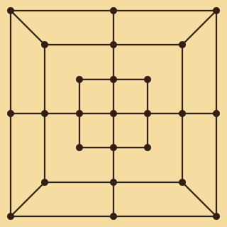
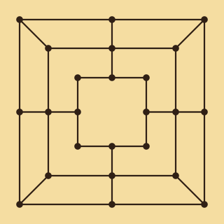
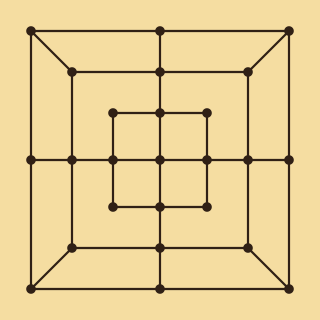

# Morabaraba Magic

A Python/Pygame implementation of **Morabaraba** with three selectable board layouts.

## Author

**Lehlohonolo Adolf Matobakele**  
Email: **lehlohonolo.matobakele@gov.ls**  
Contact: **00266 62320704**

## Features

- Play against the computer
- Local two-player mode
- 12 cows per player
- Placement, movement and flying phases
- Mill detection and captures
- Win detection by reducing an opponent to two cows or blocking all legal moves
- Three selectable board layouts
- Board-specific capture rules
- Boards are rendered directly in Python during gameplay

## Board choices

### Board 1



25 playable points with an active centre cross. In this build, a cow inside a mill is not protected from capture.

### Board 2



24 playable points with an open centre. Cows inside a mill are protected unless every remaining opponent cow is already in a mill.

### Board 3



A compact visual version of the 25-point centre-cross topology used by Board 1.

## Requirements

- Python 3.8+
- Pygame 2.5+

## Installation

```bash
python -m pip install -r requirements.txt
```

## Run

```bash
python morabaraba_magic.py
```

## Controls

- **Mouse**: choose game mode and board, place cows, select cows, move and capture
- **Esc**: return to the main menu
- Use the on-screen **New Game** and **Boards** buttons while playing

## Project structure

```text
morabaraba-magic/
├── assets/
│   ├── board_1.svg
│   ├── board_2.svg
│   └── board_3.svg
├── morabaraba_magic.py
├── requirements.txt
├── .gitignore
└── README.md
```

## Current status

The game currently supports desktop play against a basic computer opponent or two local players. Online multiplayer is not yet implemented.
